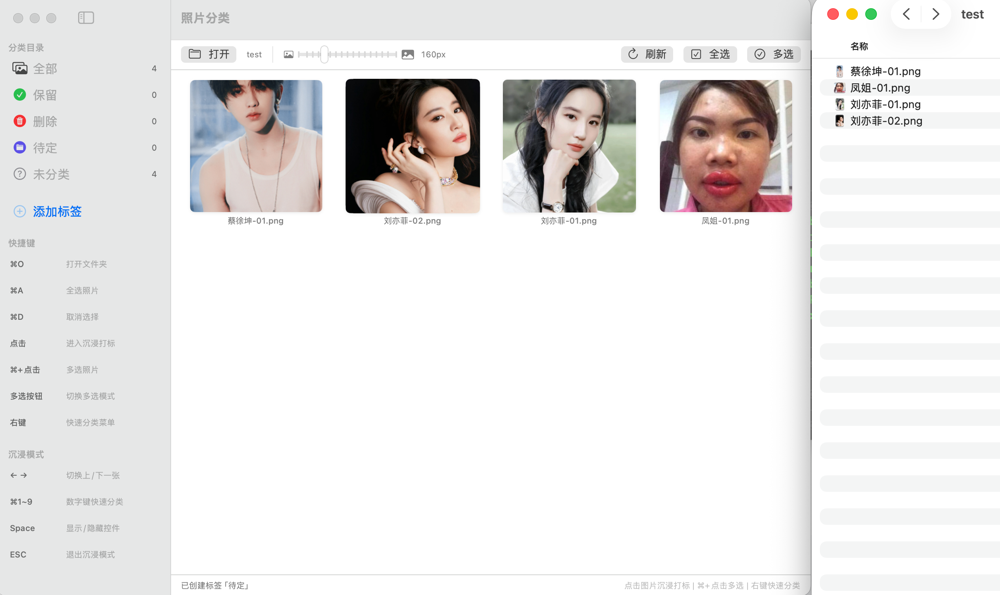
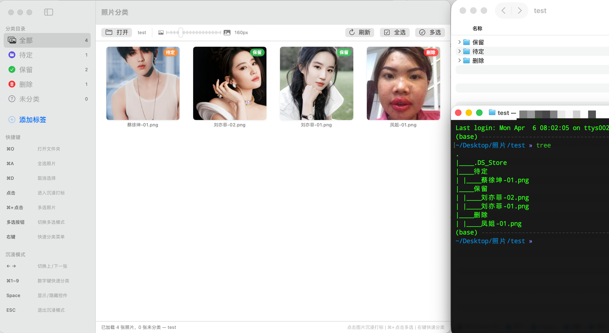

# 图片整理 (PhotoClassifier)

一款轻量级的 macOS 原生照片/视频归类整理工具。通过文件夹目录结构管理标签，支持全屏沉浸式浏览归类，帮助你快速整理大量照片和视频文件。


## 功能特点

- **目录即标签** — 子文件夹名称自动识别为归类标签，移动文件即完成归类
- **全屏沉浸浏览** — 双击照片进入全屏查看模式，使用快捷键极速归类
- **视频支持** — 支持 MP4、MOV、MKV 等常见视频格式的预览和归类
- **批量操作** — 多选模式一键切换，单击即可选中，也支持 ⌘+点击多选，批量移动到目标归类
- **实时反馈** — 打标后即时显示 Toast 提示和标签状态变化
- **键盘优先** — 全程键盘操作，⌘+数字快速归类，方向键切换照片
- **原生体验** — 纯 SwiftUI + AppKit 开发，无第三方依赖

## 截图

| 网格浏览 | 归类整理 | 沉浸浏览 |
|:---:|:---:|:---:|
|  |  |  |

## 安装

### 方式一：直接下载

从 [Releases](../../releases) 页面下载最新的 `PhotoClassifier.zip`，解压后将 `PhotoClassifier.app` 拖入"应用程序"文件夹。

### 方式二：从源码构建

```bash
git clone https://github.com/baker-yuan/photo-classifier.git
cd photo-classifier
open PhotoClassifier.xcodeproj
```

使用 Xcode 16+ 打开项目，选择 `PhotoClassifier` scheme，按 ⌘R 运行。

**系统要求：** macOS 13.0 (Ventura) 或更高版本

## 使用方法

### 1. 选择工作目录

启动应用后，点击"选择文件夹"或按 `⌘O` 打开一个照片根目录。

**目录结构约定：**
```
照片根目录/
├── 保留/          ← 自动识别为标签"保留"
│   ├── IMG_001.jpg
│   └── IMG_002.heic
├── 删除/          ← 自动识别为标签"删除"
│   └── IMG_003.png
├── 风景/          ← 自动识别为自定义标签
│   └── IMG_004.jpg
├── IMG_005.jpg    ← 根目录文件 = "未归类"
└── IMG_006.mp4    ← 视频文件同样支持
```

### 2. 网格浏览模式

- 左侧边栏显示所有归类标签和对应数量
- 点击标签筛选查看特定归类的照片
- 拖动滑块调整缩略图大小
- 支持右键菜单快速归类单张照片

### 3. 全屏沉浸打标

- **点击任意照片**进入全屏沉浸模式
- 底部显示所有标签按钮，附带快捷键提示
- 标记后自动停留在当前位置，由你决定下一步

### 4. 快捷键一览

| 快捷键 | 功能 | 适用模式 |
|--------|------|----------|
| `⌘O` | 打开文件夹 | 全局 |
| `⌘A` | 全选照片 | 网格 |
| `⌘D` | 取消选择 | 网格 |
| `⌘+点击` | 多选照片 | 网格 |
| `多选按钮` | 切换多选模式，单击选中 | 网格 |
| `右键` | 快速归类菜单 | 网格 |
| `单击照片` | 选中照片 | 网格 |
| `双击照片` | 进入沉浸打标 | 网格 |
| `← →` | 上/下一张 | 沉浸 |
| `⌘1` ~ `⌘9` | 数字键快速归类 | 沉浸 |
| `Space` | 显示/隐藏控件 | 沉浸 |
| `ESC` | 退出沉浸模式 | 沉浸 |

## 支持的文件格式

### 图片
JPG, JPEG, PNG, HEIC, HEIF, TIFF, TIF, BMP, GIF, WebP, RAW, CR2, NEF, ARW

### 视频
MP4, MOV, M4V, AVI, MKV, WMV, FLV, WebM, 3GP, MTS, TS

## 技术架构

```
PhotoClassifier/
├── ClassifierApp.swift        # 应用入口，菜单命令
├── ClassifierViewModel.swift  # 核心 ViewModel，文件操作逻辑
├── MainView.swift             # 主界面，侧边栏，工具栏，状态栏
├── PhotoGridView.swift        # 网格视图，缩略图，右键菜单
├── PhotoDetailView.swift      # 全屏沉浸视图，标签按钮，窗口管理
└── PhotoModel.swift           # 数据模型，缩略图缓存
```

### 核心设计

- **MVVM 架构** — `ClassifierViewModel` 作为唯一数据源，驱动所有视图
- **文件即状态** — 不使用数据库，文件在目录间移动即为归类操作
- **原生全屏** — 使用 borderless `NSWindow` 实现真正的全屏沉浸体验
- **线程安全** — 文件 I/O 在后台线程执行，UI 更新回到主线程
- **竞态保护** — 快速连续操作通过序列化标志防止数据竞争
- **智能缓存** — `NSCache` 管理缩略图缓存，自动内存回收

### 技术栈

| 组件 | 技术 |
|------|------|
| UI 框架 | SwiftUI + AppKit |
| 图片处理 | Core Graphics (`CGImageSource`) |
| 视频缩略图 | AVFoundation (`AVAssetImageGenerator`) |
| 视频播放 | AVKit (`VideoPlayer`) |
| 文件管理 | Foundation (`FileManager`) |
| 全屏窗口 | AppKit (`NSWindow` / `NSPanel`) |

## 构建

```bash
# 命令行构建
xcodebuild -project PhotoClassifier.xcodeproj \
           -scheme PhotoClassifier \
           -configuration Release build

# 产物位置
open ~/Library/Developer/Xcode/DerivedData/PhotoClassifier-*/Build/Products/Release/
```

## 许可证

MIT License - 详见 [LICENSE](LICENSE) 文件

## 贡献

欢迎提交 Issue 和 Pull Request。

1. Fork 本仓库
2. 创建功能分支 (`git checkout -b feature/amazing-feature`)
3. 提交更改 (`git commit -m 'Add amazing feature'`)
4. 推送到分支 (`git push origin feature/amazing-feature`)
5. 创建 Pull Request
